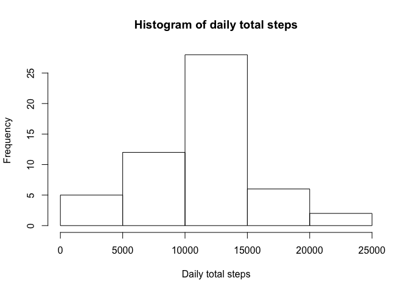

# Reproducible Research: Peer Assessment 1


## Loading and preprocessing the data

```r
setwd("~/Dropbox/Files/ds/reproducible/RepData_PeerAssessment1")
activity <- read.csv(unz("activity.zip","activity.csv"), header = TRUE)
```

## What is mean total number of steps taken per day?
1. Histogram of the total number of steps taken each day

```r
dailyTotalSteps <- aggregate(steps ~ date, data = activity, FUN = sum, na.action = na.omit)
hist(dailyTotalSteps$steps, main = "Histogram of daily total steps", xlab = "Daily total steps")
```

 

2. The mean and medium total number of steps taken per day

```r
mean_dailyTotalSteps <- mean(dailyTotalSteps$steps)
median_dailyTotalSteps <- median(dailyTotalSteps$steps)
```
Based on the calculation above, the mean daily total steps is 1.0766189\times 10^{4}; and the median daily total steps is 10765.

## What is the average daily activity pattern?
1. A time series plot on average daily activity pattern

```r
meanStepsPerInterval <- aggregate(steps ~ interval, data = activity, FUN = mean, na.action = na.omit)
plot(meanStepsPerInterval$interval, meanStepsPerInterval$steps, type = "l", main = "Average daily activity pattern", xlab = "Hour (5 minute interval)", ylab = "Average Steps", col = "Blue")
```

 

2. Find the interval with maximum average steps

```r
maxStepInterval <- meanStepsPerInterval[which.max(meanStepsPerInterval$steps),1]
```
Based on the calculation above, the interval that has the maximum average steps is 835.

## Imputing missing values
1. Calculate and report the total number of missing values in the dataset.

```r
countNA <- sum(is.na(activity$steps))
```
Total missing values in the dataset is 2304.

2. The strategy for filling the missing values inthe dataset is to use the mean of the interval from the days with non NA values. The new dataset is called activity_imput.

```r
## First copy the dataset
## Then locate the records with missing steps
## Finally, replace with the mean if missing
activity_imput <- activity
missing <- which(is.na(activity_imput$steps))
for (i in 1:length(missing)) {
    j = missing[i]
    missingInterval <- activity_imput[j,3]
    activity_imput[j,1] <- meanStepsPerInterval[which(meanStepsPerInterval$interval == missingInterval),2]}
```

3. Histogram of the total number of steps taken

```r
dailyTotalStepsImput <- aggregate(steps ~ date, data = activity_imput, FUN = sum, na.action = na.omit)
hist(dailyTotalStepsImput$steps, main = "Histogram of daily total steps (Imputed)", xlab = "Daily total steps")
```

 

The mean and medium total number of steps taken per day after imputation

```r
mean_dailyTotalStepsImput <- mean(dailyTotalStepsImput$steps)
median_dailyTotalStepsImput <- median(dailyTotalStepsImput$steps)
```
Based on the calculation above, the mean daily total steps is 1.0766189\times 10^{4}; and the median daily total steps is 1.0766189\times 10^{4}. It's worth noting that the mean stays the same since the imputation used the mean value; while the median changes a little as the imputation may change the rank order of the total daily steps.

## Are there differences in activity patterns between weekdays and weekends?
1. Create a new factor variable in the dataset with two levels

```r
activity$dayOfWeek <- ifelse(weekdays(as.Date(activity$date)) %in% c("Saturday","Sunday"), "weekend", "weekday")
```

2. Make a panel plot and compare weekday days and weekend days

```r
meanStepsPerIntervalByDayOfWeek <- aggregate(steps ~ interval + dayOfWeek, data = activity, FUN = mean, na.action = na.omit)
library(lattice)
xyplot(steps ~ interval | factor(dayOfWeek), data = meanStepsPerIntervalByDayOfWeek, type = 'l', aspect = 0.5, xlab = "Hour (5 minute interval)", ylab = "Average Steps" )
```

 

A visual comparision shows that on weekdays, the sample typically gets up earlier and has a "morning rush" around 8:30 AM; on weekends, there is a slight increase of activity during the day.
